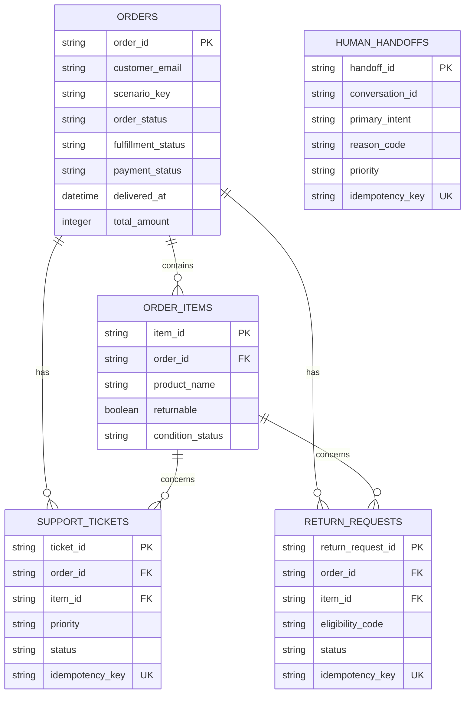

# Giai đoạn 1–2 — Python Environment và SQLite Mock Data

## 1. Mục tiêu

Giai đoạn này tạo nền dữ liệu deterministic để các tool ở Milestone 2 có thể hoạt động mà không phụ thuộc Medusa, Chatwoot hoặc hệ thống thật.

Kết quả cần có:

- Python 3.11 virtual environment.
- SQLite database có schema, foreign key, index và transaction.
- Seed data theo từng scenario nghiệp vụ, đã mở rộng ở Stage 2.
- Pydantic domain models.
- Repository layer dùng parameterized query.
- Return eligibility service bằng rule code.
- Idempotency cho write action.
- Structured audit log.
- Unit tests.

## 2. Cấu trúc

```text
src/support_agent/
├── config.py
├── cli.py
├── db/
│   ├── connection.py
│   ├── schema.sql
│   ├── seed.py
│   └── validation.py
├── models/
│   └── domain.py
├── repositories/
│   ├── orders.py
│   ├── tickets.py
│   ├── returns.py
│   ├── handoffs.py
│   └── audit.py
└── services/
    ├── return_eligibility.py
    └── idempotency.py
```

## 3. Mô hình dữ liệu



`human_handoffs` không bắt buộc phải có order ID vì unknown, safety hoặc user-requested-human cũng có thể handoff.

## 4. Scenario seed

Seed data ban đầu có 6 scenario chính. Ở Stage 2, dữ liệu đã được mở rộng có chủ đích để đủ edge case cho dự án cá nhân:

```text
19 orders
36 order_items
6 support_tickets
4 return_requests
4 human_handoffs
```

Nhóm scenario chính:

- Tracking: shipped, processing, cancelled, payment failed.
- Return: eligible day 3, eligible day 7, expired day 8, expired day 20, not delivered.
- Item policy: non-returnable item, used item.
- Damaged product: normal damage và critical safety incident.
- Authorization: wrong email không được đọc dữ liệu qua owner-safe helper.
- Entity resolution: ambiguous product name và multi-item non-ambiguous.
- Payment/handoff: refunded cancelled order và partially refunded order.

Không ép một đơn duy nhất đại diện cho nhiều trạng thái mâu thuẫn. Mỗi order phục vụ một scenario cụ thể.

## 5. Quy tắc xác minh

Demo verification:

```text
order_id + customer_email khớp chính xác trong database
```

Repository chỉ trả `True/False`; không trả email đúng và không tiết lộ đơn thuộc người khác.

## 6. Return eligibility

Rule `return-rules-v1`:

1. Item phải thuộc order.
2. Order phải có `fulfillment_status = delivered`.
3. Có `delivered_at` hợp lệ.
4. Item phải `returnable = true`.
5. Item không ở trạng thái `used`.
6. Số ngày từ khi giao không vượt quá `SUPPORT_AGENT_RETURN_WINDOW_DAYS`.

LLM không được sửa kết quả rule.

## 7. Idempotency

Write tools sử dụng key từ:

```text
action + conversation_id + business identifiers
```

Cùng key gọi lại sẽ trả bản ghi cũ thay vì tạo ticket/return/handoff mới.

## 8. Chạy trên Windows

```powershell
Set-ExecutionPolicy -Scope Process Bypass
.\scripts\setup.ps1
```

Hoặc chạy thủ công:

```powershell
py -3.11 -m venv .venv
.\.venv\Scripts\Activate.ps1
python -m pip install -e ".[dev]"
Copy-Item .env.example .env
python -m support_agent.cli reset-db
python -m support_agent.cli inspect-db
python -m support_agent.cli check-db
pytest
```

## 9. Lệnh CLI

```bash
python -m support_agent.cli init-db
python -m support_agent.cli seed-db
python -m support_agent.cli reset-db
python -m support_agent.cli inspect-db
python -m support_agent.cli check-db
```

Có thể override đường dẫn:

```bash
python -m support_agent.cli --db data/mock/custom.db reset-db
```

## 10. Tiêu chí hoàn thành

- Seed validation pass.
- `PRAGMA foreign_key_check` không có lỗi.
- Verification đúng và owner-safe helper không lộ dữ liệu khi email sai.
- Item resolution có `single`, `ambiguous`, `none`.
- Eligibility có đủ scenario chính.
- Write repository idempotent.
- Audit log ghi structured event.
- Toàn bộ unit test pass.
